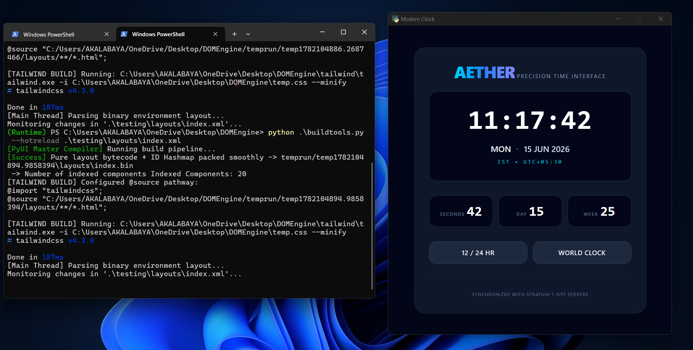

# PYUI Buildtools

PYUI comes with few simple buildtools to make life of developer easy.

    1. HotReloading Layouts
    2. Compile to executable python project
    3. Compile to executable

## Hot-Reloading Layouts

It gets hectic to compile layouts after each edit so PYUI comes with hotreloading feature to quickly rebuild your static layout file to show on screen.

For Hot-Reloading a static layout:

    python -m PYUI.buildtools --hotreload <xml-layout-file-path>

**Result:**

Any change to the xml file will be instantly reflected in the window

Additionally, if you want to keep the layout window always on top of your screen, you would like to use **--keepontop** flag.

    python -m PYUI.buildtools --hotreload <xml-layout-file-path> --keepontop

## Compiling to python project

It is slower to compile whole project to .exe as it reqires pyinstaller to build executable. However for faster loading and debuging purposes, you can compile your project to a ready to use project to load your dynamic app in a single command.It is recomended to use this than compiling to exe often after each result. Compiled exe will be idential to this exactly.

    python -m PYUI.buildtools --compile <xml-layout-file-path>

A temporary folder will be created: **build/temp_xyz** (Check the last line of your terminal to get the folder) go to that folder and 

    python bootstrap.py

The app will load as it is in compiled executable stage.

## Compiling to executable

For distribution purposes it is absolutely important to build project into exe.

Install **pyinstaller** (If not installed):

    pip install pyinstaller

Compile to Exe:

    python -m PYUI.buildtools --compileexe <project-directory> 

Important Extra flags for Executable compilation:

1. **--target**
    
    1. DEBUG: For general purpose debuging purposes
    2. RELEASE: For release
    3. Default: **DEBUG**

2. **--console**

    1. **Any value other than blank**: This will keep the console in background in the final compiled exe.

3. **--name**

    1. Define the name of the exe
    2. DEFAULT:  **PYUICommonExecutable**

